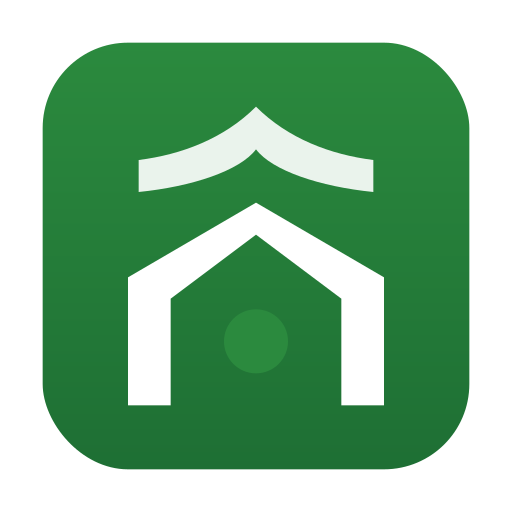

<div align="center">
  
  <h1>The Masjid App</h1>
  <p><em>Home Assistant custom integration</em></p>
</div>

## Introduction

The Masjid App integration for Home Assistant brings your local mosque's prayer schedule right into your smart home. By fetching prayer times from `themasjidapp.net`, this integration allows you to create powerful automations, such as playing the Azan, preparing your home for prayer, and receiving timely reminders.

**Note**: This is an unofficial integration and is not affiliated with `themasjidapp.net`.

## Key Features

- **Prayer Time Sensors**: Creates sensors for both Azan and Iqama times for all daily prayers.
- **Automated Azan Playback**: Plays the Azan on your smart speakers at the correct time.
  - **Per-Prayer Volume Control**: Set a custom volume for each of the five daily prayers.
  - **Pause & Resume**: Automatically pauses other media players during the Azan and resumes them afterward.
- **Advanced Pre-Prayer Automation**:
  - **Car Start**: Automatically start your car a few minutes before prayer time.
  - **Water Recirculation**: Trigger your water pump to ensure hot water is ready for wudu.
  - **Presence-Aware**: Automations only run when you're home, based on your configured presence sensors.
- **Ramadan Reminders**: Get a special TTS reminder before Maghrib prayer during the month of Ramadan.
- **Fully UI-Configurable**: No YAML required. Set up and manage the integration entirely through the Home Assistant UI.
- **Robust & Resilient**: Caches prayer times to ensure automations run even if the server is temporarily unavailable.

## Installation

[](https://my.home-assistant.io/redirect/hacs_repository/?owner=sabaatworld&repository=ha-the-masjid-app&category=integration)

### HACS (Recommended)

1.  Add this repository to HACS as a custom repository.
2.  Search for "The Masjid App" integration in HACS and install it.
3.  Restart Home Assistant.
4.  Go to **Settings → Devices & Services → Add Integration** and search for "The Masjid App".

### Manual Installation

1.  Copy the `custom_components/ha_the_masjid_app` folder into your Home Assistant `config/` directory.
2.  Restart Home Assistant.
3.  Go to **Settings → Devices & Services → Add Integration** and search for "The Masjid App".

## Configuration

The integration is configured through the UI. Here are the available options:

| Option                        | Required | Description                                                                                                                                                           |
| ----------------------------- | :------: | --------------------------------------------------------------------------------------------------------------------------------------------------------------------- |
| **Masjid ID**                 |   Yes    | The numeric ID of your mosque from `themasjidapp.net`.                                                                                                                  |
| **Refresh Interval**          |   Yes    | How often (in hours) to fetch updated prayer times.                                                                                                                   |
| **Media Player for Azan**     |    No    | The `media_player` entity that will play the Azan audio.                                                                                                              |
| **Azan Media Content**        |    No    | The media content for the Azan (e.g., a local file or URL).                                                                                                           |
| **Azan Duration**             |    No    | The length of your Azan audio file in seconds.                                                                                                                        |
| **Media Players to Pause**    |    No    | A list of `media_player` entities to pause during the Azan.                                                                                                           |
| **Water Recirculation Action**|    No    | The service to call for water recirculation (e.g., `script.start_pump`).                                                                                              |
| **Car Start Action**          |    No    | The service to call to start your car (e.g., `script.warm_car`).                                                                                                      |
| **Presence Sensors**          |    No    | A list of sensors to determine if someone is home.                                                                                                                    |
| **TTS Entity for Ramadan**    |    No    | The `tts` entity to use for Ramadan reminders.                                                                                                                        |

## Entities Created

This integration creates the following entities, all prefixed with a sanitized version of your mosque's name (e.g., `sensor.your_mosque_fajr_azan`):

-   **Sensors**:
    -   `sensor.<mosque>_<prayer>_azan`: The time of the Azan for each prayer.
    -   `sensor.<mosque>_<prayer>_iqama`: The time of the Iqama for each prayer.
    -   `sensor.<mosque>_last_fetch_time`: When prayer times were last fetched.
    -   `sensor.<mosque>_last_cache_time`: When prayer times were last cached.
-   **Switches**:
    -   `switch.<mosque>_azan`: Enable/disable Azan playback.
    -   `switch.<mosque>_ramadan_reminder`: Enable/disable Ramadan reminders.
    -   `switch.<mosque>_car_start`: Enable/disable the car start automation.
    -   `switch.<mosque>_water_recirculation`: Enable/disable the water recirculation automation.
-   **Numbers**:
    -   `number.<mosque>_<prayer>_azan_volume`: Adjust the Azan volume for each prayer.
    -   `number.<mosque>_car_start_minutes`: Set the offset (in minutes) for the car start automation.
    -   `number.<mosque>_water_recirculation_minutes`: Set the offset for the water recirculation automation.
    -   `number.<mosque>_ramadan_reminder_minutes`: Set the offset for the Ramadan reminder.
-   **Buttons** (for diagnostics and testing):
    -   `button.<mosque>_force_refresh`: Manually fetch the latest prayer times.
    -   `button.<mosque>_test_azan`: Play a test Azan.
    -   `button.<mosque>_test_azan_schedule`: Test the Azan scheduling logic.
    -   `button.<mosque>_test_prayer_schedule`: Test the prayer automation scheduling logic.

## Advanced Details

-   **Scheduling**: The integration's scheduler automatically updates when new prayer times are fetched or when any of the minute-offset numbers are changed.
-   **Caching**: If the integration cannot fetch new prayer times, it will use the last successfully fetched data from its cache.
-   **Entity Naming**: The mosque name is sanitized to create valid and unique entity IDs.

## Development Setup

For developers, the easiest way to set up a development environment is to clone this repository into your Home Assistant `config` directory and then create a symbolic link to the `custom_components` directory.

If you have placed this repository at `/config/workplace/ha_the_masjid_app` within your Home Assistant OS environment, you can use the following command to create the symlink:

```bash
ln -s /config/workplace/ha_the_masjid_app/custom_components/ha_the_masjid_app /config/custom_components/ha_the_masjid_app
```

After creating the link, restart Home Assistant to load the custom component.

## Support & Contribution

If you have any issues or suggestions, please [open an issue on GitHub](https://github.com/sabaatworld/ha-the-masjid-app/issues).

Authored by [Sabaat Ahmad](mailto:sabaatworld@gmail.com).
